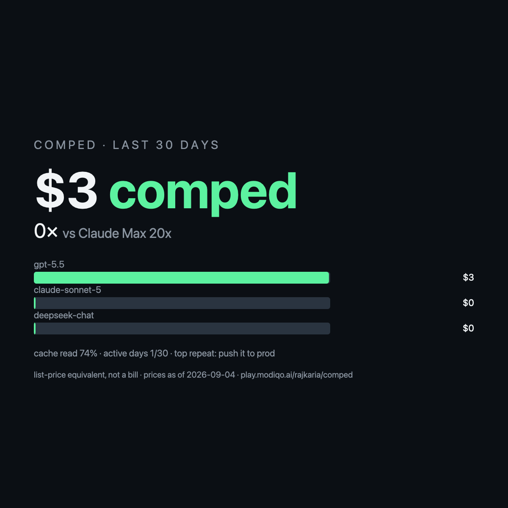

# Comped

> Every coding session on your machine already wrote down what it consumed. This reads it and gives you one card: what the last 30 days would have cost at API list price, the multiplier against the plan you actually pay for, the jobs you keep re-asking your agent, and what each repeat would cost as a Play.



*Rendered from the synthetic fixtures in this repo, so the numbers are small. On real logs they are not.*

**Site and docs:** [comped landing page](https://rajkaria.github.io/comped/) · [full docs](https://rajkaria.github.io/comped/docs.html)

## What it does

Three rote Plays on one stdlib-only Python core:

| Play | What it gives you |
|---|---|
| [`session-ledger`](docs/plays/session-ledger/DESCRIPTION.md) | One deduplicated ledger of usage records, human messages and tool calls from Claude Code (including subagents), Codex, Pi and OpenCode. The primitive other session Plays should read instead of re-parsing logs. |
| [`comped`](docs/plays/comped/DESCRIPTION.md) | The card: list-price total, multiplier vs your plan, cache-read share, delta since your last run, repeat offenders with the `/play settle` command to capture each, and the Rote dividend at 98% and 80%. Markdown report, SVG and PNG card, share text. |
| [`wrong-turns`](docs/plays/wrong-turns/DESCRIPTION.md) | Your agent's recurring mistakes — tool errors, your corrections, reverts — with recovery cost, one redacted line of evidence per class, and drafted `CLAUDE.md` / `AGENTS.md` rules it never applies for you. |

## How it works

1. **Read.** One step per harness, in parallel. Claude Code writes one line per content block, so roughly four in ten usage lines are streaming duplicates of the same API call; they are collapsed on `(message.id, requestId)`. Codex writes cumulative counters, so per-turn values are differences. Subagent transcripts live in a subdirectory and are counted. A missing harness is an expected absence, not an error.
2. **Merge.** The reads join into one ledger and every record and tool event is bound to the human message that started its turn.
3. **Price.** `usd = uncached_input×in + cache_write×cw + cache_read×cr + output×out`, in `Decimal`, against a bundled price table that names its source, upstream sha and as-of date. A model the table does not know is reported with its token counts and never priced by guess.
4. **Read back.** Repeat asks are clustered (Jaccard ≥ 0.5 on 2-shingles, qualifying at ≥ 3 asks across ≥ 2 sessions and ≥ 2 days) and priced; recurring mistake classes are drafted into rules. Every number has a line in `comped-explain.txt` showing the arithmetic that produced it.

## Getting started

Try it on the bundled synthetic logs first — no configuration, nothing of yours read:

```bash
rote play run https://play.modiqo.ai/rajkaria/comped claude_dir=resources/fixtures/claude codex_dir=resources/fixtures/codex plan=claude-max-200
```

Then on your own:

```bash
rote play run https://play.modiqo.ai/rajkaria/comped plan=claude-max-200
```

The core also runs on its own, with nothing but `python3`:

```bash
python3 -m comped_core ledger --days-back 30 --out-dir ~/comped
```

## Built with

- **rote** (Modiqo) — the Plays are rote Flows; every step is a shell command whose stdout is one JSON object.
- **python3 stdlib only**, ≥ 3.9. No pip installs, no node, no lockfile. `Decimal` for money, `unittest` for tests.
- **A bundled LiteLLM price snapshot**, regenerated by `tools/build_prices.py`, which records the source URL, the upstream file's sha256 and the date it was taken.

## Methodology

The full derivation — record model, per-record pricing, deduplication, windows and plan proration, the price table, repeat clustering and wrong-turn signals — is [SPEC §7](docs/SPEC.md#7-the-core-math). Two claims worth stating here:

- **List price is not a bill.** It is what the same tokens would have cost on the API at the table's published rates. Your plan is a subscription; the multiplier is the ratio, nothing more.
- **The plan is typed by you.** The tool refuses to read your OAuth files to discover it.

Token totals for Claude Code are checked against [ccusage](https://github.com/ryoppippi/ccusage) in CI, per model, under identical deduplication.

## Privacy

Reads: session logs under the configured directories. Nothing else. Never reads: `~/.claude.json`, `~/.codex/auth.json`, any credential, keychain or token file; plan is typed by you. Never sends: no network calls of any kind. Writes: only under `out_dir`, every path listed in the report. Message text: truncated to 120 characters and hashed by default.

Enforced by tests, not just promised: the suite fails if `comped_core` imports `urllib`, `http`, `socket`, `requests` or `ssl`, if any module other than the PNG renderer mentions `subprocess`, or if any source line references a credential path.

## Known limitations

- **Pi and OpenCode adapters are best-effort.** Their schemas came from public documentation and fixtures, not from an installed client on the machine that wrote this. Each labels itself as such in its source note.
- **PNG needs a renderer.** `rsvg-convert` or macOS `qlmanage`. Without one the SVG is still written and the step says so instead of failing.
- **`gpt-5.5-codex` is unpriced** until the upstream table carries it, as are any other models absent from the snapshot. They appear with token counts under "unpriced" and are never estimated.
- **Windowing is by each record's own timestamp**, so a session that spans the window boundary contributes only the records inside it.

## Development

```bash
python3 -m unittest discover -s tests -v   # 84 tests
python3 tools/sync_plays.py --check        # Plays bundle a byte-identical core
```

## Links

- [`docs/SPEC.md`](docs/SPEC.md) — the build spec, including the math and the output design.
- [`VISION.md`](VISION.md) — where this goes after the week it was built in.
- [`docs/research/LANDSCAPE.md`](docs/research/LANDSCAPE.md) — what already exists, measured rather than assumed.
- Plays: `play.modiqo.ai/rajkaria/session-ledger`, `/comped`, `/wrong-turns`.

## License

MIT
